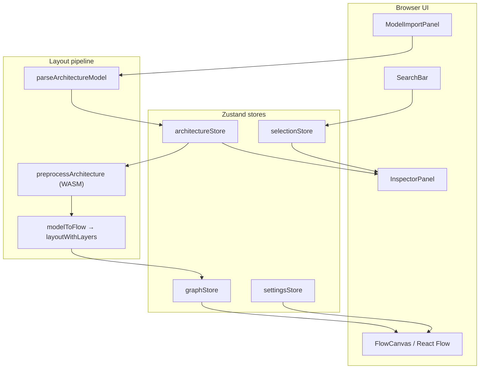
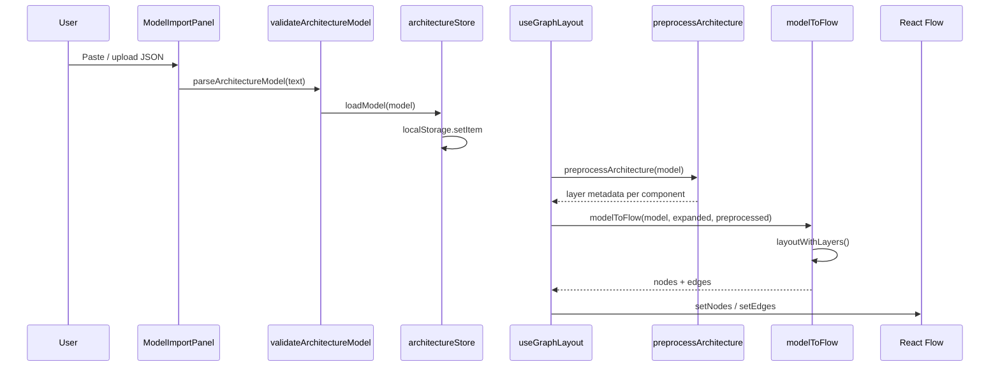
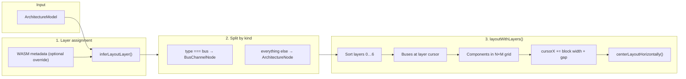
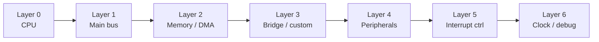
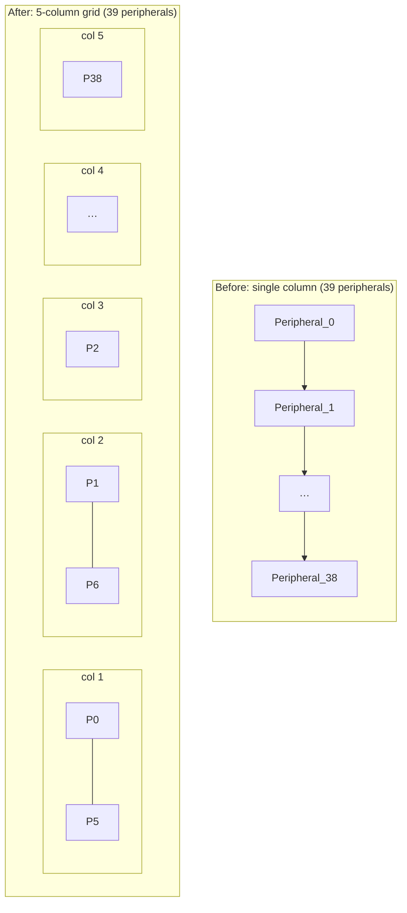
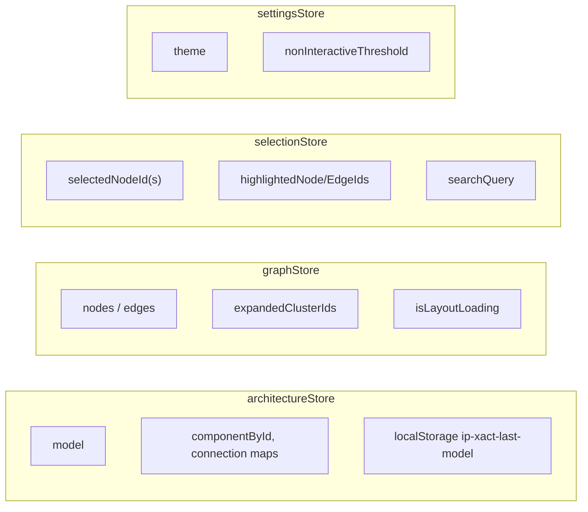
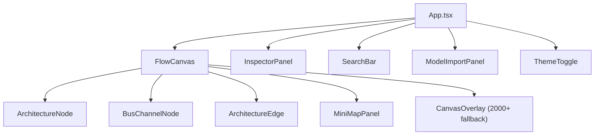
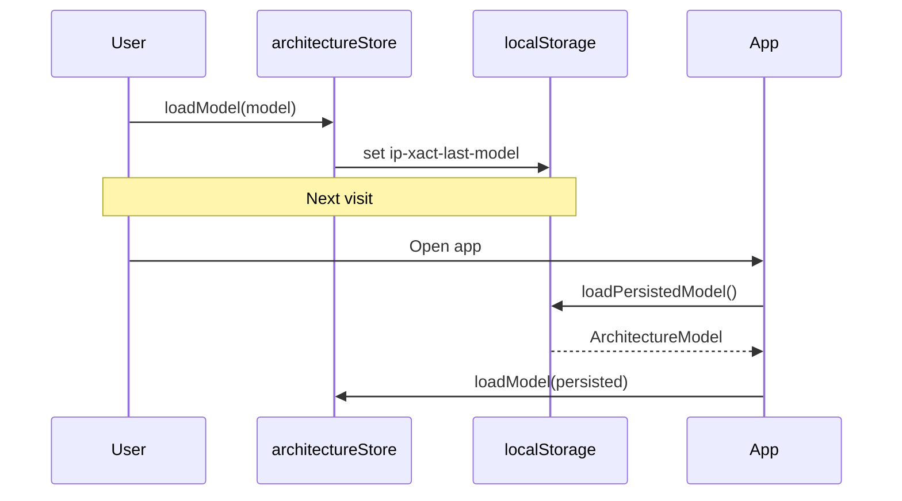
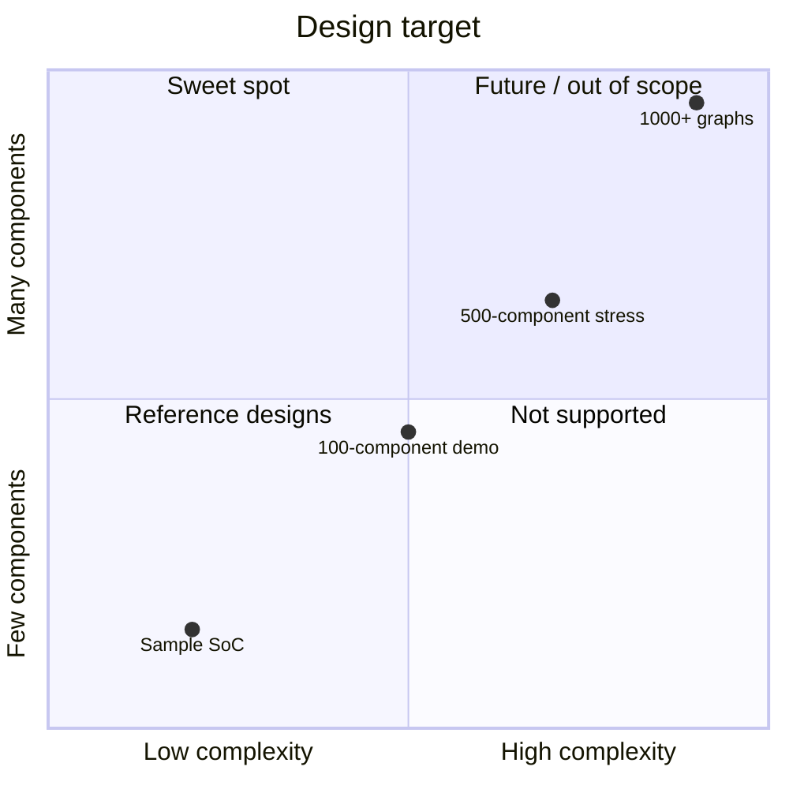

# IP-XACT Viewer — Architecture

This document describes how the application works end-to-end: data flow, layout engine, UI layers, and state.

## System overview

## What the layout engine does (and does not do)

| Does | Does not |
|------|----------|
| Assign each component to a **semantic layer** (CPU, bus, memory, …) | Use ELK.js or Dagre for global positioning |
| Place layers **left → right** in fixed order (0 → 6) | Auto-discover topology from edges |
| Spread dense layers into **multiple sub-columns** | Optimize for 1000+ node graphs |
| Render buses as **vertical channel nodes** | Change layer order based on connections |

ELK code exists under `src/lib/elk/` but is **not wired** into the active pipeline. All positions come from `layoutWithLayers()`.

## Data flow

## Layout pipeline (core)

## Semantic layers (columns)

Components are placed in **layer order**, not by graph analysis.

| Layer | Contents | Node shape |
|-------|----------|------------|
| 0 | CPU | Standard block |
| 1 | AXI / main interconnect | Vertical bus channel |
| 2 | SRAM, flash, DMA | Standard block |
| 3 | APB bridge, custom IP | Bridge = bus channel |
| 4 | UART, SPI, GPIO, … | Standard block |
| 5 | NVIC, GIC, … | Standard block |
| 6 | Clock, JTAG, pads | Standard block |

**Source files:**
- `src/lib/transform/layerAssignment.ts` — type/name → layer index
- `src/lib/transform/modelToFlow.ts` — `layoutWithLayers()`
- `src/lib/transform/layerGridLayout.ts` — sub-column grid math
- `src/components/graph/nodes/BusChannelNode.tsx` — bus rendering

## Intra-layer grid (fixes vertical elongation)

When a layer has many components (e.g. 39 peripherals), a **single vertical stack** becomes unusably tall (~6 000 px). The grid spreads nodes into multiple sub-columns while keeping the layer block anchored.

### Column count rules (`layerGridLayout.ts`)

| Nodes in layer | Sub-columns |
|----------------|-------------|
| ≤ 6 | 1 |
| 7–14 | 2 |
| 15–28 | 3 |
| 29–48 | 4 |
| 49–72 | 5 |
| 73+ | 6 (max) |

### Horizontal placement

Layers are placed **sequentially** left to right:

1. Buses at current `cursorX` (narrow vertical bar)
2. Component grid at `cursorX` (width = columns × 280 px)
3. `cursorX` advances by block width + 140 px gap
4. Entire diagram centered with `centerLayoutHorizontally()`

This preserves SoC reading order (CPU → bus → memory → …) while growing **horizontally** instead of vertically when a tier is dense.

## Example: 100-component graph

Typical distribution in `example/100components.json`:

| Type | Count | Layer |
|------|-------|-------|
| peripheral | 39 | 4 → **5 columns × 8 rows** |
| custom | 21 | 3 → 4 × 6 |
| interface | 12 | 6 → 2 × 6 |
| memory | 7 | 2 |
| debug | 6 | 6 |
| dma | 5 | 2 |
| interruptController | 4 | 5 |
| bus | 3 | 1 / 3 |
| cpu | 2 | 0 |
| clockReset | 1 | 6 |

Without the grid, layer 4 alone would be 39 × 160 px ≈ **6 240 px tall**. With 5 columns it is 8 × 160 px ≈ **1 280 px tall**.

## State management

## UI component map

## Persistence

## Clustering (large graphs only)

Clustering activates when `components.length >= 1001` (`hierarchyBuilder.ts`). Below that threshold every component is shown individually — the normal case for this viewer.

## Intended scope

**Sweet spot:** ~10–150 components, correct component types, JSON import.

## Roadmap

- IP-XACT XML import (planned)
- In-app editing (planned)

## Key file index

| Path | Role |
|------|------|
| `src/lib/validateArchitectureModel.ts` | JSON parsing & normalization |
| `src/lib/transform/layerAssignment.ts` | Semantic layer rules |
| `src/lib/transform/layerGridLayout.ts` | Sub-column grid & centering |
| `src/lib/transform/modelToFlow.ts` | Nodes, edges, `layoutWithLayers()` |
| `src/hooks/useGraphLayout.ts` | Orchestrates preprocess → modelToFlow |
| `src/lib/preprocess/` | WASM wrapper for metadata |
| `src/store/architectureStore.ts` | Model + localStorage |
| `src/components/graph/FlowCanvas.tsx` | React Flow host |
